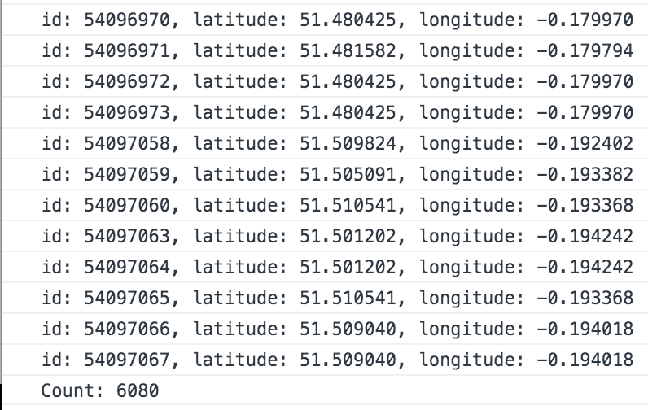
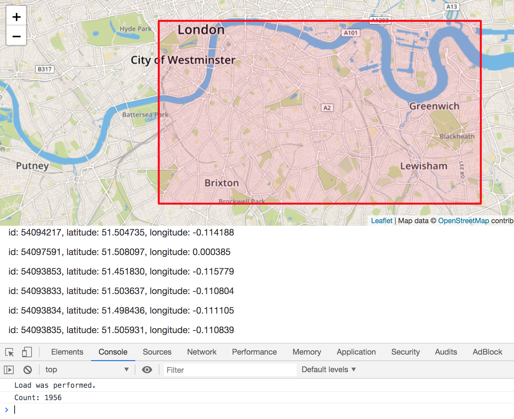

# McYobbo
Using Police API and McDonald's store location data, to see if level of anti-social "yobbo" crime is higher in the vicinity of a MackyD venue

### Police API
Polygon set for the crime data request to Police API: that is South London, i.e. Lambeth, Peckham, Greenwich.   

<code>
$.get( "https://data.police.uk/api/crimes-street/anti-social-behaviour?poly=" + bottom_lat + "," + left_long + ":" + bottom_lat + "," + right_long +":" + top_lat + "," + right_long + ":" + top_lat + "," + left_long + "&date=2017-01", .........
</code>

### Extracting McDonalds' store data
From this url https://www.mcdonalds.com/gb/en-gb/restaurant-locator.html, I extracted details of all stores within 5 miles of Peckham, which falls within the centre of the polygon I set for the crime data request.  

<code>  
$('#rl-listView .restaurant-location__address-container').each(function(){  
    console.log("'"+ $(this).find('.restaurant-location__title').html() + "','" + $(this).find('.restaurant-location__address').html().replace('<b>','').replace('</b>','').replace(' ',', ') + "'");  
});  
</code>  

### Output  
  

### ASBO map   
   
